# Introduction

In this tutorial, we'll download and organize genetic data from genbank, an online repository. We'll do this the long way so that you can see how the data are actually stored.

# Step 1 - Download GenBank data

## Step 1.1 What data do you want? Choosing an outgroup.

You already know what group you're working on, but you need to know one more group before we get started; the *outgroup*. An outgroup is a taxon closely related to, but outside of your focal group. We need to include outgroups in phylogenetic analyses for two main reasons.

1.  **Test the monophyly of our focal group.** Are they really all each other's closest relatives, or do our outgroups actually group within our focal group?

2.  **Establish trait polarization.** What was the ancestor of our group like? For instance, if our group contains a clade of black birds and a clade of red birds, how can we reconstruct whether the ancestor was red or black? Well, if all of the outgroups are red, we would favor red as the *ancestral state* for our focal group. Since we know what the ancestral state is, we can know when that state changed versus when it stayed the same.

Since we have a pretty good grasp on bird phylogeny, we can look at an already existing phylogenetic tree to find appropriate outgroups for your focal group. [onezoom.org](https://www.onezoom.org/OZtree/static/OZLegacy/EDGE_birds.htm) provides an easy-to-use, publically available visualization of the tree of life. Click on the link and you'll be taken to the onezoom bird phylogeny.

Click on the binoculars icon and you'll see a little search bar at the bottom of your screen. Make sure the "Latin" box is checked and you can search for your focal group name by scientific or common name. When you find that focal group, take a look at their sister group - the one that branches directly opposite them. Zoom in on this sister group until you can see its scientific name. Write down the names of 2-3 species within the sister group; you will look for data on these species in addition to your focal group so that you can demonstrate the monophyly of your focal group and polarize their traits. **NOTE YOU CAN USE 1 OUTGROUP AND IT WILL WORK OUT FINE IN PRACTICE.** If there is only 1 species in your outgroup, choose a species from sister clade of the outgroup + focal group clade.

We'll use a **vector** to keep track of our outgroup birds. A vector is a series of values that are all of the same type, and here the type will again be a "string". To make a vector, we use the function `c()` . Right now, it has the names of 2 species of *Philentoma*, the genus sister to the Malagasy Vangas (subfamily Vanginae). When you go through this tutorial with your own birds, replace the names. Make sure you use underscores here rather than spaces; the phylogenies we'll use later on won't like spaces in the tip names.

```{r INPUT: second favorite birds}
my_outgroup <- c("Philentoma_velata","Philentoma_pyrhoptera")
saveRDS(object = my_outgroup, file = "My_Data/my_second_favorite_birds.rds")
```

You can access the contents of vectors by their index using square brackets `[]`.

```{r indexing}
my_outgroup[1]
my_outgroup[2]
my_outgroup[6]
```

Notice that when we ask for an index that doesn't exist, we get `NA` back.

## Step 1.2 What data do you want? Choosing a gene.

The majority of genetic data that scientists have produced for phylogenetics can be found on [GenBank](https://www.ncbi.nlm.nih.gov/nuccore). Click the link to go there now; you'll land on the search page with the drop-down search menu set to "Nucleotide." Set that box to "Taxonomy."


In the search bar next to the dropdown menu, type the name of the Family or Genus you want to explore. I have chosen my beloved Vangidae for this example.

If your group name exists in the NCBI Taxonomy, you'll see a link under the taxon name on the results page labelled "Nucleotide." Click on that.

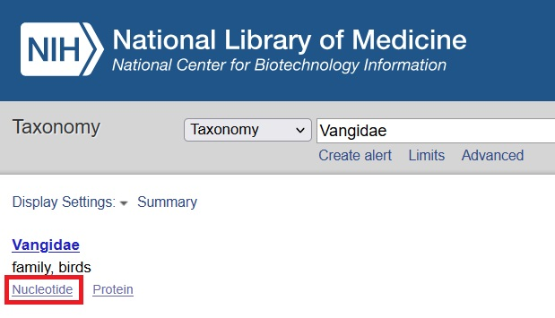{width="500"}

You now have search results for all of the nucleotide sequences in GenBank for that taxon, possibly with an overwhelming amount of results. My page returned items 1 to 20 of 441! Notice that the taxon name isn't there. Instead, it's been replaced with the GenBank ID for that taxon, which will give you better search results.

Instead of scrolling through all the results while crying, you can refine this search even further to look for a specific gene.

Because nearly every eukaryotic cell has many mitochondria in it, and each mitochondrion has its own genome, it has historically been much easier to sequence mitochondrial DNA than nuclear DNA. As a result, mitochondrial genes have often been sequenced in many more species than nuclear genes. A few of the most widely sequenced genes in birds are

-   Cytochrome b (abbreviated **cytb**)

-   Cytochrome c oxidase I (abbreviated **cox1**, **co1**, or **COI**)

-   NADH dehydrogenase 2 (abbreviated **nd2**)

Add **AND cytb** to your search and see how many results you get. On the right hand side of the screen, there is a panel titled "Results by taxon" Make sure this shows a list. How many species are there? Mark this down in the R code block below.

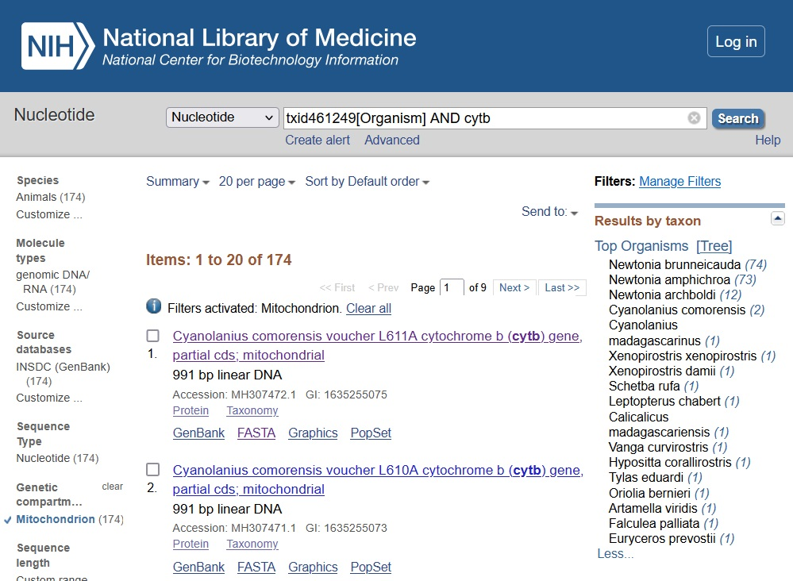

Next, replace **AND cytb** with **AND (cox1\|co1\|coi)** in your search. Again, note the number of species. Finally, repeat the search one more time, replacing **AND (cox1\|co1\|coi)** with **AND nd2**. Note how many species you get.

We'll keep track of how many species we find in a named vector. A named vector is just like a vector, but the elements can be accessed by their names, rather than only by their indices. Again, we use the `c()` function. The code block below holds the counts for Vangidae, which you can replace with the counts for your birds.

```{r INPUT gene availability}

species_represented <- c(
  cytb = 17,
  co1 = 14,
  nd2 = 20
)
```

What's the best gene to use for our tree? The best way to improve the accuracy of a tree is to increase the number of tip taxa in it. So we want to use the gene represented by the largest number of species. Obviously, you can see what's best, but if we were dealing with a really long vector, R can save us a lot of time. Use the `sort()` function to sort the vector `species_represented`. The first argument will be the ting you want to sort (`species_represented`). The second argument, `decreasing` is a **logical**. It must be set to `TRUE` or `FALSE`. `decreasing` tells the function whether (`TRUE`) or not `FALSE` you want to sort in decreasing order.

```{r best gene}
sort(species_represented, decreasing = TRUE)
```

For the vangas, we want **nd2**.

## Step 1.3 Download the data for real

Ok, we now know:

-   our focal group (Vanginae)

-   two taxa to use as an outgroup (the *Philentoma* species)

-   our gene of interest (nd2)

So let's get all the data we can - it's free for the taking!

Remember that list of results by taxon?

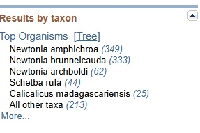

The numbers in parentheses beside each species indicate how many records are available. You can click “more” to the see the entire list. Select one of the species you want to work with. I selected *Calicalicus madagascariensis* (red-tailed vanga). This will take you to the page for that species with a much more manageable set of results.

Now you’ll be able to select your nucleotide sequence. The title of each result will tell you two key pieces of information: whether the nucleotide sequence is partial or complete (red box in image below) and the gene (black box in the image below). A complete sequence is preferable, but it’s okay to use partial if complete sequences are not available—it will just need to be aligned. For the Vangas, we're using nd2 data.

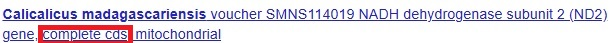

If you click the link, you’ll be taken to the page for that particular nucleotide sequence. There are three links under the title—select FASTA, which is on the far left.

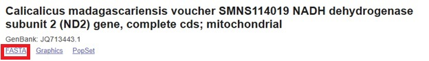

You should now have a page that looks like this:

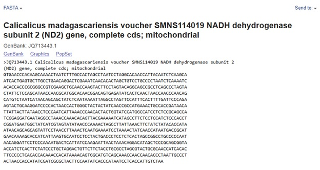

in Rstudio, click on the upside-down carrot next to the little green 'plus' in the upper left hand corner below 'File' and open a new text file.

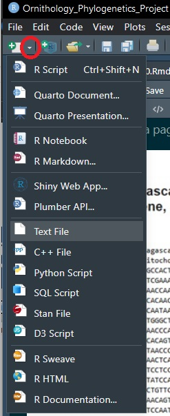

Copy and paste the FASTA file into the text editor. Shorten the top line label so that you only have the GenBank #, Genus, Species, and gene name. Make sure you keep the `>` character at the beginning. Put underscores where there are currently spaces. It should look like this:

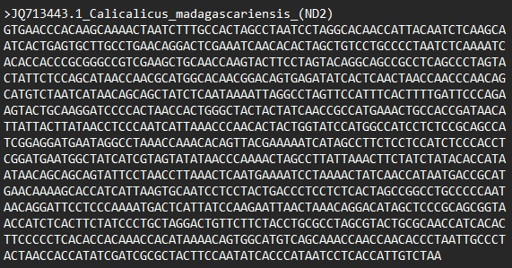

Repeat this with four more species, [including one of your outgroup taxa]{.underline}, putting a blank line in between each nucleotide sequence. To see an example file, open the Example_Data folder and then the file Vangidae.txt.

You'll add more taxa to this file later; for now, we want to make sure what you have is working and will work in the next few steps.

### Sidebar - What if I find whole genomes?

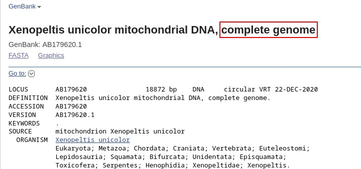

Often, you'll come across GenBank Accessions of whole mitochondrial genomes. These accessions will (hopefully) have your chosen mitochondrial gene in them, and you'll have to go about downloading those data a little bit differently.

On the whole genome page, look through the "FEATURES" section for your gene of interest and click on the "CDS" link.

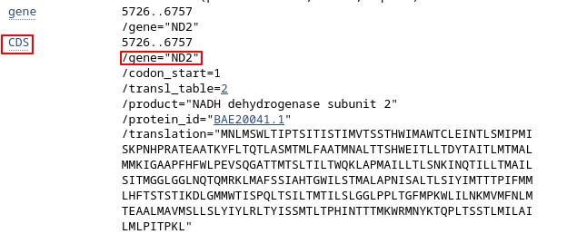

Either this will open up a little bar at the bottom of your page that will have a FASTA link, or you will need to open this link in a new tab. In the new tab, there will be a FASTA link like you've seen on other genes, and you'll be able to copy in just the data for your one gene.

### Save the file

Remember `my_favorite_birds`? If not, type `my_favorite_birds` into the console. Those are your favorite birds, your focal group. Use the save icon to save your text file with all of the FASTAs as `your focal group.txt` in the My_Data folder.

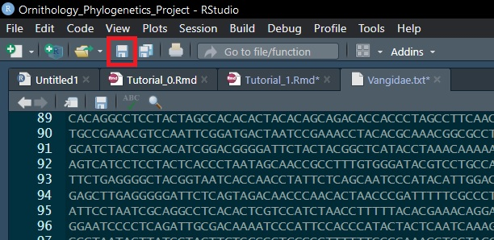

You're done with step 1 for now! Return to that file later to add more species.

# Step 2 - Align Data

Ok, so you have a big text file full of A, T, G, and C. If you have a biology background, you know that those letters stand for the four nucleotide bases that encode all of the information in DNA. You also know that differences in sequences of nucleotides differ between organisms. Sometimes that produces differences in proteins, or differences in where, when, or how much RNA is transcribed to produce a protein. Sometimes the differences don't functionally do anything! As phylogeneticists, the functional implications of sequences don't much matter to us; it's the differences in sequences that we care about.

However, DNA sequences for the same gene can differ in more than just the As, Ts, Gs, and Cs. Nucleotides can be *inserted* into or *deleted* from the sequence, and this happens very frequently! This creates a problem for us when comparing the sequences. If two sequences for the same gene have different lengths, how do we know how the sequences correspond to each other? We need to know where those *deletions* and *insertions* occurred. So we have to [align]{.underline} the DNA.

The algorithms for and strategies of DNA alignment are way beyond the purview of our class. Aligning sequences is an interesting and well-researched problem in computer science, and can take a lot of computational power. Conveniently, there's a publicly-available resource for alignment out there that's very easy for us to use called [MAFFT](https://mafft.cbrc.jp/alignment/server/index.html).

## Step 2.1 Submit data to MAFFT

Head on over to [MAFFT](https://mafft.cbrc.jp/alignment/server/index.html). Do as the box says; either copy in your data or upload your .txt file.

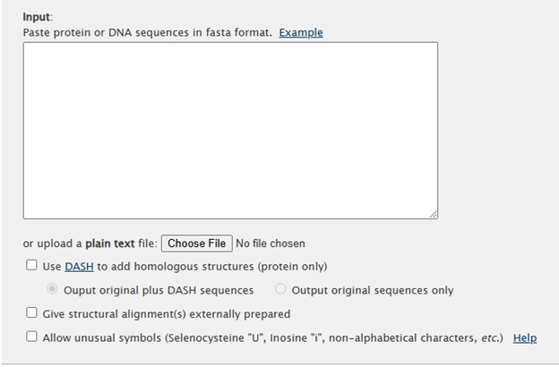

For "Direction of nucleotide sequences", choose the 2^nd^ option: “adjust direction according to the first sequence (accurate enough for most cases)”. For output order, select “same as input”. All other fields can be left as the default. See example below:

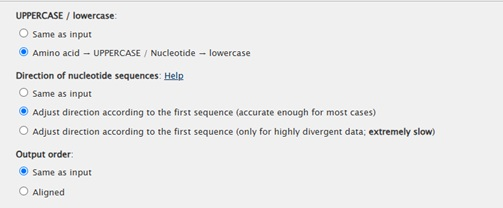

Click submit and you will be taken to the results page. Pay close attention to the plots on the left side of the page—if you have blue lines, that means the nucleotide sequence was reversed. You will need to click “open all plots” to see all of them - it will download a .pdf file.

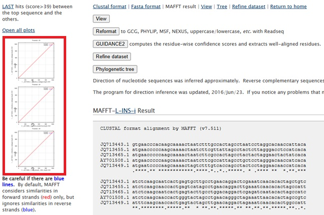

## Step 2.2 Download your alignment from MAFFT

There are five options under MAFFT result to the right of the plots. Choose the second option, Reformat. This will open a new window. Select "Pearson\|fasta\|fa" under the Output sequence format dropdown menu. For “Return biosequence data”, choose to download to file, then click submit. This will download a file named “readseq.txt”—rename this file to something more useful and put it in the My_Data folder. (I named mine Vangidae_aligned.txt; it's saved in the Example_Data folder).

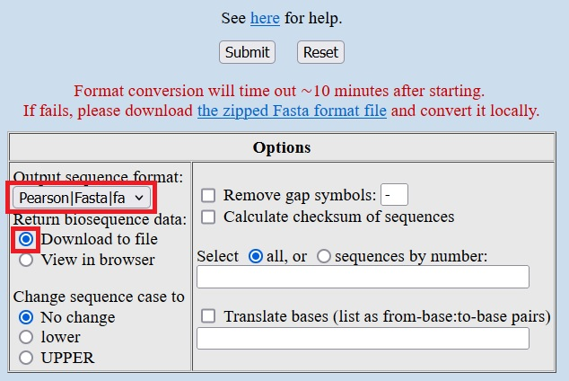

Now you have an aligned set of sequences!

## Step 2.3 Visualize your alignment

What is that alignment, though?

You can open it as a text file and see it has the same format as the FASTA file you constructed - but now there are a bunch of dashes interspersed among the sequences. These dashes are gaps in the sequences relative to the other sequences. Not so intimidating, right? All MAFFT did was figure out where to put those dashes.

The other thing you'll notice is that the headers are now much longer. Take a moment now to **cut the headers down to just the taxonomic names**; delete the accession numbers and gene names. This will really help when visualizing our data later.

Obviously, these data are a little bit more complicated than the data types we've used in R thus far. It's not just a string of characters - it's several long strings of characters (the sequences) with metadata associated with them (the headings). We'd like to be able to use R to reorganize, analyze, and manipulate the data. To do that, we'll need to expand R's capabilities using a **package**.

An R **package** is a bunch of R code or data that someone has collected, written, put together, and, hopefully, tested. They can be downloaded from CRAN, just like R itself, and we can download and install them in one easy step from inside R.

To work with our alignment and build trees, we'll need the `phangorn` package. You will only need to install this once - skip this step after the first time you do it!

```{r install phangorn, eval = FALSE}
install.packages('phangorn')
```

Installation will take a moment! R will also install a few other packages that `phangorn` relies on.

Notice that nothing really changed in your R environment. That's how it should be. `phangorn` gives you a bunch of new functions and datasets, but you have to load the package to use them.

```{r load phangorn}
library('phangorn')
```

Again, nothing obviously changes. But now you have access to new functions. for instance, we can read FASTA files into R now using the `read.phyDat()` function.

We will read that data into an R object called `alignment`. We therefore need to tell `read.phyDat()` where our `file` is, what `format` it is in, and what `type` of data is in the file. When opening your own fasta, make sure to replace the filepath below with the correct filepath to your data.

```{r INPUT open aligned data}
alignment <- read.phyDat(file = "Example_Data/Vangidae_aligned_cleanlabels.txt", 
                         format = "fasta", 
                         type = "DNA")
```

You should have an object called `alignment` in your R environment now (upper right panel). You'll see that R calls this a **List**. A list is like a vector, but not all of the parts have to be the same. A list can hold a bunch of different objects, or a bunch of complex objects, or a bunch of different complex objects, you name it. They're very useful, and we can pick elements out of them kind of like we do in vectors, but we use double square brackets `[[]]` instead of single square brackets `[]`.

Let's use the `summary()` function to see what r can tell us off the cuff about `alignment`

```{r the alignment is a list}
summary(alignment)
```

This can print out pretty nasty looking if you haven't cut down your sequence names to just genus and species.

Notice that in the Vangidae alignment, all of the names end in 1381 bp, but the Length listed is 275. We can see this by using the `length` function to measure the length of the first element in the `alignment` list.

```{r length of alignment}
length(alignment[[1]])
```

Why are our sequences in this object so much shorter than the length of the aligned sequences? Simple: `alignment` is a special object called a `phyDat` that `phangorn` uses to track sequences. To save memory, the `phyDat` object stores the general alignment once, then just the variable sites for each of our individual sequences.

Finally, let's check that all of the sequences in our alignment are unique and have unique names. If we have duplicate sequences or duplicate names, we'll run into trouble during phylogenetic inference and character reconstruction. If you see any values marked `TRUE` in the table below, you'll need to change the names or data in your alignment.

**DATA DUPLICATION SHOULD BE OK???**

```{r check unique names}
#Are any of the names or sequences duplicated?
data.frame(names = names(alignment),
           name_dup = duplicated(names(alignment)),
           data_dup = duplicated(alignment))
```

As our last exercise today, we'll generate a simple visualization of our alignment. The matrix below will look messy (in part because of those annoying long names), but it's good enough to show what's going on. For each sequence, we have colored A, T, G, and C, or black space for missing/deletion areas. If there's a lot of black space, it might be worth (later on) investigating different sequence alignment parameters.

```{r visualize alignment, fig.width = 8, results='hide', out.width = "100%"}
my_favorite_birds <- readRDS("My_Data/my_favorite_birds.rds")

#set up the plot space
par(mai = c(0.5, 3.5, 0.5, 0.1), cex.lab = 0.1)
#plot out our alignment
image(alignment)

#save an image of the alignment
jpeg(file = paste0("My_Figures/",my_favorite_birds,"_alignment.jpg"))
par(mai = c(0.5, 2.5, 0.5, 0.1), cex.lab = 0.1)
image(alignment)
dev.off()
```
