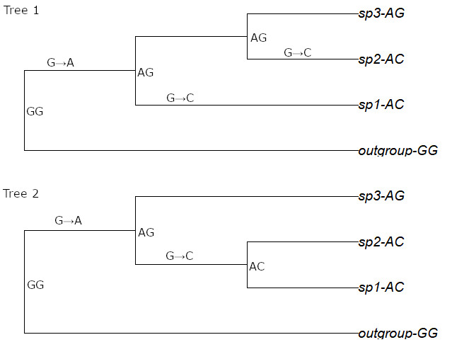

# Introduction

A phylogenetic tree is a hypothesis of how a set of organisms are genetically related. It hierarchically groups organisms into clades, and then those clades into clades, and so on, producing a multifurcating structure that represents the relationships between the organisms. You or I could draw a phylogenetic tree for our focal group, making our best guesses as to how species are related and clades are related, and we might produce a pretty reasonable phylogenetic hypothesis. But our logic for making this tree might not be very consistent or well-thought-out, and we might have a lot of trouble deciding what kinds of data support which relationships.

Methods of phylogenetic inference apply a set of rules to a set of character data for organisms, producing a phylogenetic hypothesis that is more consistent than our human guesswork. They don't necessarily find the correct answer, the phylogeny that actually represents the way evolution has happened, but they do produce a hypothesis that is reproducible and, at least in principle, possible to understand the creation of in depth.

Today we'll apply three methods of phylogenetic inference to our molecular character data, using **distance**, **maximum parsimony**, and **maximum likelihood** criteria to infer phylogenies.

# Baby Steps (Example Data Only)

To get a sense of how phylogenetic inference methods work, we'll look at a tiny subset of our example data; a stretch of 22 bases in the Vanginae nd2 sequences with 5 variable sites. In the code chunks below, we subset our data to just those 5 variable sites (variable sites 15-20) and plot out an alignment for them. **Note that this section probably won't work with your data** as it relies on singling out just a few particular positions in the Vanga alignment.

```{r load phangorn, message = FALSE, results='hide', fig.keep='all'}
library(phangorn)
```

```{r load mini alignment}
#DO NOT LOAD IN YOUR OWN DATA HERE
#
mini_alignment <- subset(read.phyDat(file = "Example_Data/Vangidae_aligned_cleanlabels.txt", 
                         format = "fasta", 
                         type = "DNA"), select = 15:20)
```

Here's what's in this subset.

```{r plot mini alignment}
par(mai = c(0.5, 2.3, 0.5, 0.1), cex.lab = 0.1)
image(mini_alignment)
```

Take a look at that alignment - it's clear that in this short region, all of the species have different sequences except for the two *Philentoma* species, which are identical. These *Philentoma* species have very different sequences compared to the Vangas. This is what we'd expect given the fact that we've brought in *Philentoma* as an outgroup.

Just by looking at this, we can start to construct hypotheses about how these animals are related based on how similar their DNA sequences are in this region. Here are a couple of reasonable hypotheses:

1.  *Vanga curvirostris* and *Tylas eduardi* look nearly identical: they should form a clade.

2.  *Vanga curvirostris*, *Tylas eduardi*, and *Calicalicus madagascariensis* all look very similar. *Calicalicus* is probably sister to the *Vanga curvirostris* + *Tylas eduardi* clade.

## Distance-based trees

One way of organizing how different these sequences are is making a **distance matrix**. A distance matrix is basically just a table that measures the differences between the sequences. For any pair of species, the distance matrix stores a measurement of how different their sequences are. The code chunk below generates a distance matrix by counting the number of differences between each pair of sequences, and opens up a viewer so that you can see the distances.

```{r distance matrix}
dm  <- dist.hamming(mini_alignment,ratio = FALSE)
#view the differences
View(data.frame(as.matrix(dm)))
```

See that the difference between any species and itself is 0. Notice, also, that the difference between the two *Philentoma* species is 0. This makes sense because these small fragments of their sequences are identical (see above.) The difference between *Calicalicus* and *Newtonia* is 15; between *Calicalicus* and *Tylas*, just 3. You can pretty much count off the differences from the alignment figure above.

A quick way to try to make a tree based on a distance matrix is by **neighbor-joining**. The neighbor-joining algorithm basically finds pairs of species (or pairs of clades, as it goes on) that have the shortest distance to each other, puts them in a clade, recalculates the distance matrix, with a new row and column for this clade, and repeats. The length of the branches is scaled to the number of differences between nodes.

```{r neighbor-joining}
mini_tree_nj <- nj(dm)
#Set up the plot
par(mai = c(0.1, 0.1, 0.2, 0.1))
#plot the tree
plot(mini_tree_nj, type = "unrooted", main="Mini neighbor-joining tree")
```

Congratulations, you just produced your first phylogenetic hypothesis for the Vanginae!

This tree probably looks very different from most phylogenetic trees you've seen, where the tips are all arranged to one side, and the tree "grows" out of a root opposite the tips. This tree is not "rooted." We haven't specified that our outgroup and focal group come from some common ancestor that is older than both of them.

But we can still learn a lot from this tree. Take a moment to look at it. Do our hypotheses from before hold up?

`1) Vanga curvirostris and Tylas eduardi form a clade.`

They do, just as we expected.

`2) Calicalicus is sister to the Vanga curvirostris + Tylas eduardi clade.`

Surprisingly, this isn't the case; *Calicalicus* forms a clade with *Hypositta*, and this clade is sister to *Vanga* + *Tylas*.

Let's root this tree so that it's a bit easier to make sense of. \*BREAK UP THE ROOT

```{r reroot the distance tree}
outgroups <- c("Philentoma_pyrhoptera","Philentoma_velata")
mini_tree_nj <- root(mini_tree_nj, outgroups, resolve.root = TRUE )
#Set up the plot
par(mai = c(0.1, 0.1, 0.4, 0.1))
#plot the tree
plot(mini_tree_nj, main="Rooted mini neighbor-joining tree")
```

Here, we get a phylogeny in which *Newtonia* is sister to all other Vanginae. Again, since both of the *Philentoma* have identical sequences, they appear together with branch lengths of zero.

## Parsimony-Based trees

Distance-based phylogenetic hypotheses often don't get us a very good tree. One reason for this is that evolution doesn't just continuously differentiate organisms as time goes on. Especially in the case of genetic data, we find a lot of convergent evolution (**homoplasy**), where distantly-related organisms evolve the same character state. If you only have 4 character states (A,C,T,and G), you can imagine that this happens a lot.

Most people who seriously work on phylogenetics would just use a distance-based tree as a quick-and-dirty way to get a sense of what the real tree might be like before they try something more complicated.

The classic method for building a phylogeny is to use parsimony. Simply put, under parsimony we try to reconstruct a tree that reflects the *minimum possible amount of evolution* to get the characters we see. What we mean by "minimum evolution" here is that we try to minimize the number of times characters have to change along the length of the tree.

### Parsimony: a toy example

Imagine we have a very simple alignment: 2 nucleotides that differ between 3 focal species and an outgroup.

```{r parsimony matrix}
characters<- matrix(
  c("A","C",
    "A","C",
    "A","G",
    "G","G"),nrow = 4, byrow = TRUE)
rownames(characters) <- c("sp1","sp2","sp3","outgroup")
characters
char.phyDat <- as.phyDat(characters)
```

```{r toy trees}
t1 <- ape::read.tree(text = "(outgroup, (sp1,(sp2,sp3)));")
t2 <- ape::read.tree(text = "(outgroup, ((sp1,sp2),sp3));")
```

The figure below visualizes these two trees and shows where nucleotide substitutions would have to take place on the tree in order to generate the nucleotide sequences we have for the four species.



Here, we assume that the common ancestor has the ancestral states "G" for position 1 and "G" for position 2 because that's what we see in the outgroup. So the first event that happens in tree 1 and tree 2 is the substitution of "G" for "A" at position 1.

At this point, the sequence for the ancestor to our 3 focal species is "AG" - the same sequence we have for sp3.

Here's where the trees differ. In tree 1, that "G" at position 2 has to change to a "C" two times - once on the branch going to sp1, once on the branch going to sp2. In tree 2, Sp1 and Sp2 form a clade, so the substitution only has to occur once, on the branch leading to that clade.

This means that tree 2 requires fewer changes to produce than tree 1: it is more **parsimonous**. We can measure the parsimony of a tree for a given dataset using the `parsimony` function.

```{r parsimony on toy trees}

parsimony(t1, char.phyDat)

parsimony(t2, char.phyDat)

```

Since the parsimony score for tree 1 is 3 and the parsimony score for tree 2 is 2, we would say that tree 2 is the preferred hypothesis. We accept a phylogeny in which only 2 changes happened, rather than 3 changes.

### Parsimony with our mini-alignment

How parsimonious is our old neighbor-joining tree?

```{r parsimony neighbor-joining}
parsimony(mini_tree_nj, mini_alignment)
```

It has a parsimony score of 37.

Parsimony trees with few taxa and few characters are easy enough to build by hand, but the difficulty grows quickly once more taxa get involved. That's why we have computers. We'll use the `pratchet` function to try to compute the most parsimonious tree by searching through a large number of possible trees. We'll make its job easier by giving it the NJ tree to start with.

```{r parsimony ratchet, set.seed(1), results='hide', fig.keep='all'}
#the pratchet algorithm uses some steps that rely on pseudo-randomly choosing what to do next. For this demo, I want you to see the exact same tree that I see, so we'll force R to pick from exactly the same vector of "random" numbers no matter when it runs this.
set.seed(1) 
# quick parsimony alignment

mini_tree_Pratchet <- pratchet(mini_alignment, start = mini_tree_nj)
```

As before, re-root the tree.

```{r re-root tree & test parsimony}
mini_tree_Pratchet <- root(mini_tree_Pratchet, outgroups, 
                           resolve.root = TRUE)

parsimony(mini_tree_Pratchet, mini_alignment)
```

Looks like we improved on the NJ tree using this parsimony search method!

As `pratchet` searches for trees, it also **bootstraps** the dataset. **Bootstrapping** means re-sampling the character dataset. We do this in order to understand how well-supported our clades are. If we always resolve a certain clade no matter what character re-sampling we do, we can be pretty confident that that clade is real. If we only resolve that clade 50% of the time, it's a coin flip whether that clade exists or not.

The code below will plot out that `pratchet`-generated tree with bootstrap support values plotted on the nodes. In general, we will have low confidence in nodes with support below 0.7 (70%).

```{r check node support pratchet}
plot(mini_tree_Pratchet, , main="Mini parsimony tree with bootstrap support") 
#Set up the plot
par(mai = c(0.1, 0.1, 0.4, 0.1))
#plot the tree
nodelabels(text = mini_tree_Pratchet$node.label)
```

What are we looking at here? We have a very well-supported Vanginae (bootstrap value of 1), with *Newtonia* as the outgroup to the rest of the Vanginae. We find *Hypositta* and *Calicalicus* are each others' closest relatives (bootstrap value of 0.9) just like we did in the NJ tree. However, we don't recover a *Vanga + Tylas* clade; instead, these genera appear as successive outgroups to the *Hypositta* and *Calicalicus* clade. Overall the tree is quite well supported, with bootstrap values between 0.8 and 1.

There's just one more step to do. Notice how all of the nodes in the tree above are evenly spaced; the tree could serve us much better if we scaled that spacing by some measure of how much evolution is happening between nodes. This will change the branch lengths. For a parsimony tree, we want branch lengths to reflect the number of evolutionary changes (base substitutions) that have happened between the nodes. We'll do this with the `acctran` function

```{r assign branch lengths}
mini_tree_Pratchet <- acctran(mini_tree_Pratchet, mini_alignment)
```

```{r plot parsimony tree with branch lengths}
#Set up the plot
par(mai = c(0.1, 0.1, 0.4, 0.1))
#plot the tree
plot(mini_tree_Pratchet, main="Mini parsimony tree with bootstrap support & scaled branches") 
nodelabels(text = mini_tree_Pratchet$node.label)
add.scale.bar(0.5,0.5, length=100)
```

We can see now that there's a really big difference between the Vanginae and the *Philentoma* outgroups, but very little difference between *Vanga* and the common ancestor of *Tylas, Hypositta, and Calicalicus*. We also see that *Hypositta* is actually quite different from *Calicalicus*.

## Maximum-Likelihood based trees

The final method we'll look at is tree search using a maximum likelihood framework. Whereas the parsimony framework sought to find the tree that implied the smallest number of character state changes in our dataset, maximum likelihood tries to find a tree that is the *most likely* to have generated our data. This might at first seem like a distinction without a difference; isn't the tree that implies the fewest number of character state changes already the most likely tree? Well, only if we assume that all types of change are equivalent, and that character state changes don't ever reverse themselves. The conceptual jump from parsimony to maximum likelihood inference is two-fold; yes, we use a different criterion for finding the best tree, but we also assume a different model of how evolution happens.

In maximum likelihood methods, we assume an explicit model of how we think the characters evolve. In the case of genetic data, we know a few different processes influence the rates of base substitutions, and we use this to inform our model. For instance, not all of the bases are equally abundant when copying DNA. It could be that there is way more of one base available than the other three, which would then make it more likely that mutations would swap that base in for any of the other three. There are also structural biases in substitution rates between the purines (A and G) and the pyrimidines (C and T). Purine to purine and pyrimidine to pyrimidine substitutions are called **transitions**, and happen at a higher rate than pyrimidine to purine and purine to pyrimidine substitutions, called **transversions**.

To find the most likely tree, we want to know the best model for rates of base substitutions. We'll use the `modelTest` function to try to fit different models to our aligned data, and see which of the following four models best fits our alignment.

-   The Jukes-Cantor (**JC**) model, in which all substitutions are equally likely.

-   The Felsenstein (1981) (**F81**) model, in which the likelihood of substitutions is proportional to the relative proportions of bases in the total dataset. This adds 3 parameters to the JC model; the difference between the substitution rates of bases T, G, and C, and A.

-   The Hasegawa, Kishino, and Yano (1985) (**HKY**) model, which builds on the proportional differences of the Felsenstein model and allows a difference between the transition rate and the transversion rate. This adds 1 parameter versus the F81 model; how much more likely is a transition versus a transversion?

-   The Generalized Time Reversible (**GTR**) model, which builds on the Felsenstein model and allows the probability of every possible type of substitution to differ symmetrically. This adds 5 parameters versus the F81 model (on top of an A-G [equivalent to G-A] transition rate, the A-C, A-T, G-C, G-T, and C-T rates)

There are other models and modifications to these models, but for simplicity's sake, we'll just test these four.

```{r mini-alignment model}
set.seed(1) 
mini_model <- modelTest(mini_alignment, model=c("JC", "F81", "HKY", "GTR"),
                G = FALSE, I = FALSE)
```

In the table above, we can see several aspects of the four models we tested.

First, `df` reports the degrees of freedom in the model; how many parameters it has, as we spelled out above.

Second, `LogLik` reports the log likelihood of that model; how likely is this model to have produced the data we see?

Third and Fourth, the `AIC` and `BIC` scores. These are the **Akaike** and **Bayesian Information Criteria**. These are estimators of prediction error; how error-prone is our model in predicting our data? These scores penalize models with more parameters, because estimating more parameters introduces more uncertainty in whether our models are really predicting reality, or just getting lucky. You can see that the GTR model has the lowest log likelihood score (since this is a logarithm of a very small number between 1 and 0, a log likelihood score closer to zero denotes a larger likelihood). However, the HKY model has the lowest AIC and BIC scores, indicating that HKY is actually a better model for our data.

Now that we've identified the best model for the evolution of these sequences, we can perform a maximum-likelihood phylogenetic estimation for our dataset using the `pml_bb` function. We'll start with our parsimony tree and then try to improve on it using an algorithm called [Nearest-Neighbor Interchange](https://en.wikipedia.org/wiki/Tree_rearrangement), which swaps the arrangements of four subtrees within the main tree.

```{r mini-ml tree, message = FALSE, results='hide', fig.keep='all'}
set.seed(1) 
mini_tree_ml <- pml_bb(mini_alignment, 
                  model = "HKY",
                  method = "unrooted",
                  
                  rearrangement="NNI")
```

In this case, with such little data to go on, our maximum-likelihood tree is almost identical to our parsimony tree.

```{r mini ML tree plotting}
mini_tree_ml$tree <- root(mini_tree_ml$tree, outgroups, 
                          main="mini ML Tree", resolve.root = TRUE)
#Set up the plot
par(mai = c(0.1, 0.1, 0.4, 0.1))
#plot the tree
plot(mini_tree_ml$tree, main="Mini maximum parsimony tree")
```

Only the branch lengths have changed slightly; we can measure the likelihood of our tree using the `pml()` function, and giving it our alignment and model data. We can see that our maximum likelihood has a sizable likelihood advantage over our maximum parsimony tree.

```{r measure likelihood of mini- parsimony tree}
pml(mini_tree_Pratchet, 
    mini_alignment, 
    model = 'HKY')$logLik

pml(mini_tree_ml$tree, 
    mini_alignment, 
    model = 'HKY')$logLik

```

# Step 3 - Build trees using a full dataset

Ok, now that we've seen how these methods work, let's build some trees based on the entire Vanginae dataset, or your entire dataset. Load in the data and set up your outgroups!

```{r INPUT load in the alignment, message = FALSE, results='hide', fig.keep='all'}
library('phangorn')
alignment <- read.phyDat(file = "Example_Data/Vangidae_aligned_cleanlabels.txt", 
                         format = "fasta", 
                         type = "DNA")
#load your favorite birds
my_favorite_birds <- readRDS("Example_Data/my_favorite_birds.rds")

# load your outgroups
outgroups <- readRDS("Example_Data/my_second_favorite_birds.rds")
```

## Step 3.1 Neighbor-joining

First, we'll build a fast neighbor-joining tree.

```{r real data neighbor-joining}
#If you care to notice, we can call funcitons inside of functions to save space in  our environment. This code makes a distance matrix based on our alignment and then makes a negihbor-joining tree from that matrix all in one step.
tree_nj <- nj(dist.hamming(alignment))
#root the tree 
tree_nj <- root(tree_nj, outgroups, resolve.root = TRUE)
par(mai = c(0.1, 0.1, 0.4, 0.1))
#plot the tree
plot(tree_nj, main=paste(c("Neighbor-joining tree of",my_favorite_birds)))
```

Pause here and take a look at your tree. You designated your outgroups, so they should be outgroups. If you encounter an error here, it's because your outgroups didn't form a clade together in this analysis. Not a huge deal at this stage, but something we will want to look out for later.\
A bigger problem might be finding very long branches in your tree. If any of your ingroup taxa show up as being very distantly related to the rest of the ingroup (on very, very long branches), that's a sign that your input data or your alignment aren't correct. Maybe the input data are mis-labeled, or maybe those samples just didn't sequence well and that error slipped past the authors. Whatever the reason, any tips that don't look trustworthy now are probably not going to look trustworthy later, so it might behoove you to remove those taxa from your dataset and re-align the data following Tutorial 1.

## Step 3.2 Parsimony

We'll use `pratchet` to perform a parsimony tree search, and we'll force it to perform 300 iterations of the search (`minit = 300`) to make sure we're exploring as many trees as possible. If you're working with a lot of taxa (20+ species) or getting different node values when you run this code, you might want to try increasing that to 500 to really do a thorough search. It will just take longer.

```{r INPUT real data pratchet, message = FALSE, results='hide',fig.keep='all'}
set.seed(1) # remove this line when you are working with your own data!
tree_parsimony <- pratchet(alignment, start = tree_nj,
                                maxit = 1000, minit = 300)
```

Re-root the tree to make sure our outgroup(s) are on the outside.

```{r re-root real tree}
tree_parsimony <- root(tree_parsimony, outgroups, resolve_root = TRUE)

#calculate the branch lengths
tree_parsimony <- acctran(tree_parsimony, alignment)
#Set up the plot
par(mai = c(0.1, 0.1, 0.4, 0.1))
#plot the tree
plot(tree_parsimony, main="Parsimony tree with bootstrap support")

nodelabels(text = round(as.numeric(tree_parsimony$node.label),2))
```

For this 7-species Vanginae dataset, we don't recover the Vanginae as a well-supported clade (bootstrap support of 0.54), but we do see strong support for a clade containing *Newtonia, Hypositta,* and *Vanga*.

Why the low support? It's probably not that `pratchet` did a bad job finding the most parsimonous tree. What's happening is likely character conflict; that the variable characters in our dataset don't all vary in the same way. For instance, at the node grouping *Tylas*, *Newtonia*, *Hypositta*, and *Vanga*, not all of the characters reflect these genera forming a clade exclusive of *Calcalicus*. Some of the characters might be the same in *Tylas* and *Calcalicus*, but different in *Newtonia*, *Hypositta*, and *Vanga*, which would conflict with the recovered grouping of *Tylas*. Perhaps some of the characters in *Tylas* are the same as those in *Philentoma*, which weakens the support for the Vanginae as a clade.

In this case, since we're looking at a single gene that evolves quickly, we might be seeing a lot of homoplasy; repeated evolution of the same character state. So perhaps some site is "C" for all of the Vanginae, but evolves to be "T" independently in *Newtonia* and *Tylas*. Since there are really only 4 states for any character, you can find a lot of homoplasy in genetic data! If we're working with a fast-evolving gene (we are) and a fairly old clade (tens of millions of years), there's been plenty of time for homoplasy to evolve.

Since we can't see all of evolutionary history, we can't really know if our low node support is due to homoplasy. It could be that there's actually a lot of hybridization going on between these groups, which violates our assumption that their evolutionary history is tree-shaped. It could also be due to [incomplete lineage sorting](https://en.wikipedia.org/wiki/Incomplete_lineage_sorting). With such a small amount of data, we can only speculate as to why we're getting what we're getting.

## Step 3.3 Maximum likelihood

As above, we'll begin our work on a maximum likelihood tree by testing a series of models to see how likely they are to have produced our alignment data.

```{r base substitution model testing, message = FALSE}

mt <- modelTest(alignment, model=c("JC", "F81", "HKY", "GTR"),
                G = FALSE, I = FALSE)
#sort the table by BIC value to find the best model
best_model <- sort_by(mt,~BIC, decreasing = FALSE)$Model[1]
best_model
```

Now you see the results of our model testing. For the Vanginae, the best-fit model is the **GTR** model.

How do we know this? We've sorted the table by the **Bayesian Information Criterion (BIC)** value. In the results of the code above, you might need to click the little arrow to see the BIC values. A lower BIC score means lower prediction error, which means we have much higher confidence in our model.

We can now measure the likelihood score of our parsimony tree based on the model we've chosen.

```{r measure likelihood of parsimony tree}
likelihood_of_parsimony_tree <- pml(tree_parsimony, alignment, model = best_model)
likelihood_of_parsimony_tree$logLik
```

We should be able to drastically improve on this tree using searches that prioritize likelihood (given our model) over pure parsimony.

### Step 3.3.1 A basic maximum likelihood tree

We'll start our likelihood tree inference in the same way we did with our mini-alignment example.

```{r ml phylogenetic estimation, set.seed(1), message=FALSE, warning=FALSE, results='hide', fig.keep='all'}
set.seed(1) #remove this when you work with your own tree!
#estimate the tree
tree_ml <- pml_bb(mt, 
                  method = "unrooted", 
                  start = tree_parsimony,
                  rearrangement="NNI")
```

Take a look at the `tree_ml` object in your environment. It's not the same as the nj or parsimony trees, which are lists of length 4, containing data for edges, edge lengths, tip labels, and nodes. Instead, `tree_ml` is a list of length 25. This object contains both a tree and a lot of information about how the tree was produced. For instance, `tree_ml$logLik` contains the log likelihood of our tree, which for the Vangidae is -5193. That's quite a lot more likely than our score of -10384.73 for the parsimony tree!

In order to plot our tree, we'll again specify the outgroups.

```{r ml tree plotting}
tree_ml$tree <- root(tree_ml$tree, outgroups, 
                     main="Maximum Likelihood Tree", resolve.root = TRUE)
#Set up the plot
par(mai = c(0.1, 0.1, 0.4, 0.1))
#plot the tree
plot(tree_ml$tree, main="Maximum likelihood tree")
```

But look here - we don't have any branch support! We can perform 100 rounds of bootstrapping on our tree using the code below. This might take a little while!

```{r bootstrap ML tree, message=FALSE, results='hide',fig.keep='all'}
set.seed(1) #remove this when you work with your own tree!
tree_ml_bootstrap <- bootstrap.pml(tree_ml, bs = 100, optNni=TRUE)
par(mai= c(0.1,0.1,0.4,0.1))
plotBS(tree_ml$tree, tree_ml_bootstrap, type="p", main="ML Tree with bootstrap support")
```

As you can see, the Vanginae tree is still pretty poorly resolved! While we have 100% support (1.0) for Vanginae as a clade, the internal relationships are unclear. It looks like *Calicalicus* very weakly comes out as sister to a *Vanga+Hypositta* clade (support of 0.16 and 0.5, respectively, for these clades). *Tylas* and *Newtonia* come out as a clade with low support (0.44), sister to the *Calicalicus + Vanga + Hypositta* clade.

Hopefully with more data (including more genes and more taxa), we could build a tree that we have more confidence in. But we can't complain too much about our results! We've just constructed a quite defensible phylogenetic hypothesis for our group, and we can learn a lot about their evolution using this as the backbone.

We can compare the topologies of our ML and Parsimony trees directly with the `cophylo` function. Sometimes this plots very messily. If that happens for you, don't worry; this is not a very important step.

```{r cophylo, message = FALSE}
library('phytools')
cophylo <- cophylo(tree_parsimony, tree_ml$tree)
#par(mai= c(0.1,0.1,2,0.1))
plot(cophylo,link.type="curved", link.col="blue", main = "Parsimony tree VS ML tree", fsize = 0.7)
```

Which one is right? We can't really know; these trees reflect different assumptions about how the characters evolved and about what the best way is to estimate phylogenetic history. There are scientists who consider parsimony trees to be more trustworthy, but most molecular phylogeneticists would trust the maximum likelihood tree far more, since we've modeled evolution much more explicitly on this tree. But if we get similar results from both methods, we can be pretty confident that we have a reasonable phylogeny to work off of for the future. Some phylogenies are very difficult to resolve, and their shape will depend a lot on which methods you use; other phylogenies will resolve robustly no matter what method you use; it all depends on the data going in, which reflect how evolution actually occurred.

### Step 3.3.2 Maximum likelihood timetree

The maximum likelihood tree we constructed isn't quite perfect for comparative biology yet. To properly compare things like the rate of evolution, we need to have **time-trees**: trees that are scaled to the actual time it took for the organisms to evolve. In a timetree, branch lengths correspond to the length of time that elapsed between nodes.

Luckily, these aren't hard to construct. We can use the same `pml_bb()` function we used before, but this time, we will make an **ultrametric** tree. In an ultrametric tree, the distance from the root to all of the tips is the same, which is what we want from a tree representing actual time; the time elapsed between the common ancestor of our whole tree and any of our samples is equivalent, since all of our samples are from the modern day. One catch to this method is that we don't root the tree with our outgroup anymore. Instead, `pml_bb` finds the longest branch in our tree and roots the tree in the middle of that branch. This is called "midpoint rooting."

If we had fossils to incorporate into our phylogeny, we could use their ages to help constrain the dates of parts of the tree, but since we're just working with modern data, the ages of parts of the tree are just best estimates based on how much molecular evolution has happened.

We're going to change a couple of other things this time, too. Instead of using NNI rearrangement to search for the tree and then performing bootstrapping later, we'll use a ratcheting function. Just like when using the parsimony ratchet, this will perform bootstrapping as the tree is estimated, giving us branch support in the final tree.

```{r ml timetree, message=FALSE, warning=FALSE, results='hide',fig.keep='all'}
set.seed(1) #remove this when you work with your own tree!
timetree <- pml_bb(
  # use our data 
  alignment,
  # use the associated best-fit model of evolution
  model = best_model,
  # we want to make an ultrametric tree
  method = "ultrametric",
  # give tip dates
  tip.dates = rep(0, length(tree_parsimony$tip.label)),
  # search through trees using a ratchet rearrangement
  rearrangement="ratchet", 
  # # set parameters for ratcheting
  ratchet.par = ratchet.control(
    iter = 20, # If no change in likelihood, stop after this many rounds
    maxit = 200, #maximum number of rounds of ratcheting
    minit = 100, #minimum number of rounds of ratcheting
    bs = 100 #number of approximate bootstrap samples
    )
  )
```

Plot out the new tree. Does it correctly place your outgroup(s) outside your focal group? This method places the root of the tree at the midpoint of the longest branch, which should be between your outgroup and your focal group. You might also find that under the assumption that the tree is ultrametric, your tree topology and branch support values change! For the Vanginae, we do recover much better support values here.

Note that the scale of this tree isn't absolute time! The scale is arbitrary, but the scales of all of the branches are comparable to each other.

```{r ml timetree plotting}
# set up plot
par(mai= c(0.1,0.1,0.1,0.1))

#plot the tree
plotBS(timetree$tree, main="Maximum likelihood timetree")
```

Ok, let's save our work. First, we'll save the plots of our Parsimony and ML Trees.

```{r save plots,message = FALSE, results='hide',fig.keep='all'}
#save the parsimony tree plot
jpeg(file = paste0("My_Figures/",my_favorite_birds,"_MP_tree.jpg"))
plotBS(tree_parsimony)
dev.off()

#save the ml tree plot
jpeg(file = paste0("My_Figures/",my_favorite_birds,"_ML_timetree.jpg"))
plotBS(timetree$tree)
add.scale.bar()
dev.off()
```

And finally, we'll save the trees themselves.

```{r save ml timetree}
saveRDS(tree_ml, paste0("My_Data/",my_favorite_birds,"_ML_tree.rds"))
saveRDS(tree_parsimony, paste0("My_Data/",my_favorite_birds,"_Parsimony_tree.rds"))
saveRDS(timetree, file = paste0("My_Data/",my_favorite_birds,"_Timetree.rds"))
```
